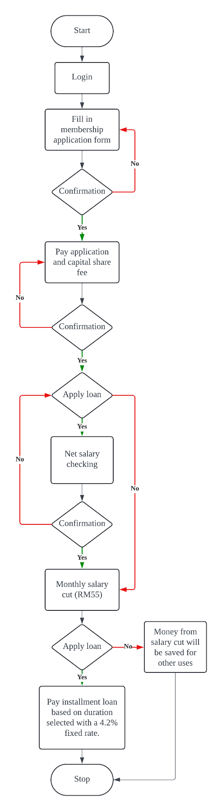

## 9.1 Current Business Process(Scenarios, Workflow)

### Workflow

### Scenario

#### Scenario 1: Mr. Haikal want to start an agriculture business but lack of capital
##### Mr. Haikal wants to start an agriculture business but lack of capital. Therefore, Mr. Haikal decides to apply RM 10000 loan from the Lembaga Kemajuan Pertanian Kemubu (KADA). In order to apply for the loan, Mr. Haikal must first become a member of the KADA. First, Mr. Haikal must access the KADA website and login the system using username and password. Then, Mr. Haikal must download the membership application form and fill in the form with his personal details like his name, phone number, ID card number, marriage status, home address, job position, net salary and etc. After fill in the form, Mr. Haikal need to submit it and wait for confirmation. The KADA will approve the registration if Mr. Haikal is qualified in a month. After getting approvement, Mr. Haikal will receive a confirmation call and he need to pay RM50 for member fee, RM5 for member welfare fund and RM300 for unit shares, with a total RM355. The RM50 should be pay in a maximum of 6 months while the RM300 can be paid in one lump sum or in installments. After becoming a member, Mr. Haikal need to download the loan application form from KADA website. Then he can choose a loan type to apply the RM10000 loan and choose the duration for installments payment. For example, he choose AL-INAH loan, so he need to pay the loan with a fixed rate 4.2%. In this case, if Mr. Haikal choose 1 year duration for installment payment, he need to pay RM868.33 per month. Therefore, he need to pay a total of RM923.33 per month which include the RM55 for member fee and RM868.33 for installments.

#### Scenario2: Mrs. Halimah is facing financial problem for her children’s school expenses

##### Mrs. Halimah is a single mother who are having 2 children who are currently about to enter primary school. She is facing financial problem for her children’s school expenses. Therefore, she decides to apply loan for about RM2000 from KADA. So, she firstly needs to become a member before applying the loan. Firstly, she needs to obtain the member registration form from KADA website, print and fill the form manually with her personal information such as name, ID card number, races, job position and etc. Then, she must submit the form to office and wait for confirmation in a month. After being approved, she needs to download the loan application form again from the KADA website, fill and submit manually to office. In this form, she can choose loan type, for example she chooses AL-BAI loan. For this loan type, there is a 4.2% fixed installment rate, and in this case let say she choose duration of 3 years. Therefore, she needs to pay RM62.56 for installment, and RM55 for member fee, so total is RM117.56 monthly.
