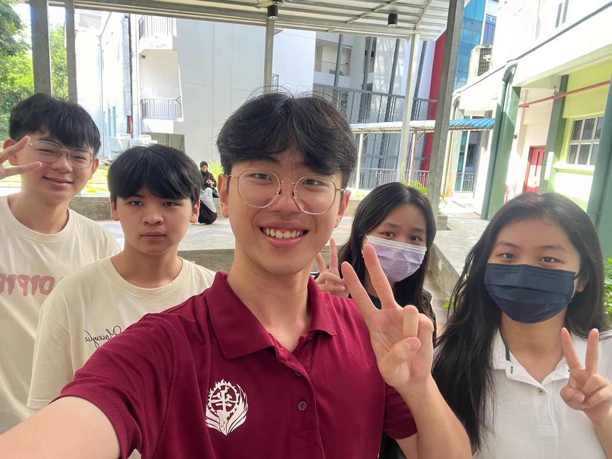

# TechMedico_20232024😆-> System Analysis Design (SAD REPORT)
### 0.0 GROUP PHOTO

## Project Part

### 1.0 Introduction
<h6> https://github.com/Elijah0413/TechMedico_Project_SAD_20232024/tree/main/1.0%20Introduction</h6>

### 2.0 Information Gathering Process
<h6> https://github.com/Elijah0413/TechMedico_Project_SAD_20232024/tree/main/2.0%20Information%20Gathering%20Process</h6>

### 3.0 Background Study
<h6> https://github.com/Elijah0413/TechMedico_Project_SAD_20232024/tree/main/3.0%20background</h6>

### 4.0 Problem Statement
<h6> https://github.com/Elijah0413/TechMedico_Project_SAD_20232024/tree/main/4.0%20Problem%20Statement</h6>

### 5.0 Proposed Solutions
<h6> https://github.com/Elijah0413/TechMedico_Project_SAD_20232024/tree/main/5.0%20Proposed%20Solutions</h6>

### 6.0 Objectives
<h6> https://github.com/Elijah0413/TechMedico_Project_SAD_20232024/tree/main/6.0%20Objectives </h6>

### 7.0 Scope of the Project
<h6> https://github.com/Elijah0413/TechMedico_Project_SAD_20232024/tree/main/7.0%20Scope%20of%20the%20project </h6>

### 8.0 Project Planning
<h6> https://github.com/Elijah0413/TechMedico_Project_SAD_20232024/tree/main/8.0%20Project%20Planning</h6>

### 9.0 Requirement Analysis
<h6> https://github.com/Elijah0413/TechMedico_Project_SAD_20232024/tree/main/9.0%20Requirement%20Analysis</h6>

<!--

## Report file
<header>
 

 
<h2> 🔍 Project 1 and project 2 Overview</h2>
  <h3>
  

 </h3>

  <h4> [Newsletter](https://github.com/Elijah0413/tis-technology-and-info-system/blob/main/assignment/assignment4/ASSIGNMENT%203%20INDUSTRY%20VISIT%20HUAWEIPETRONAS%20GROUP%202%20(1).pdf)</h4>

 

  <h3>
  

  -->
